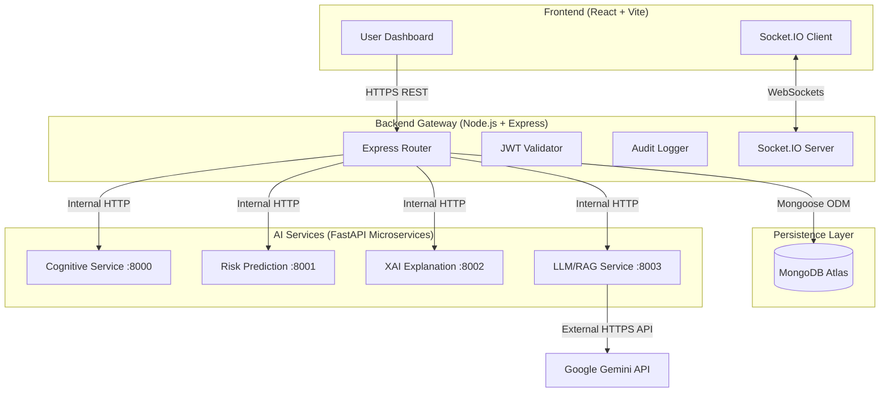
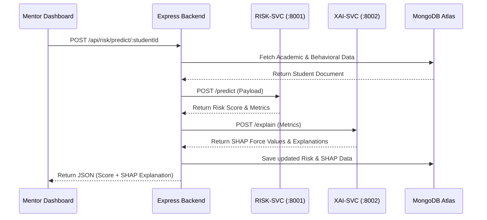
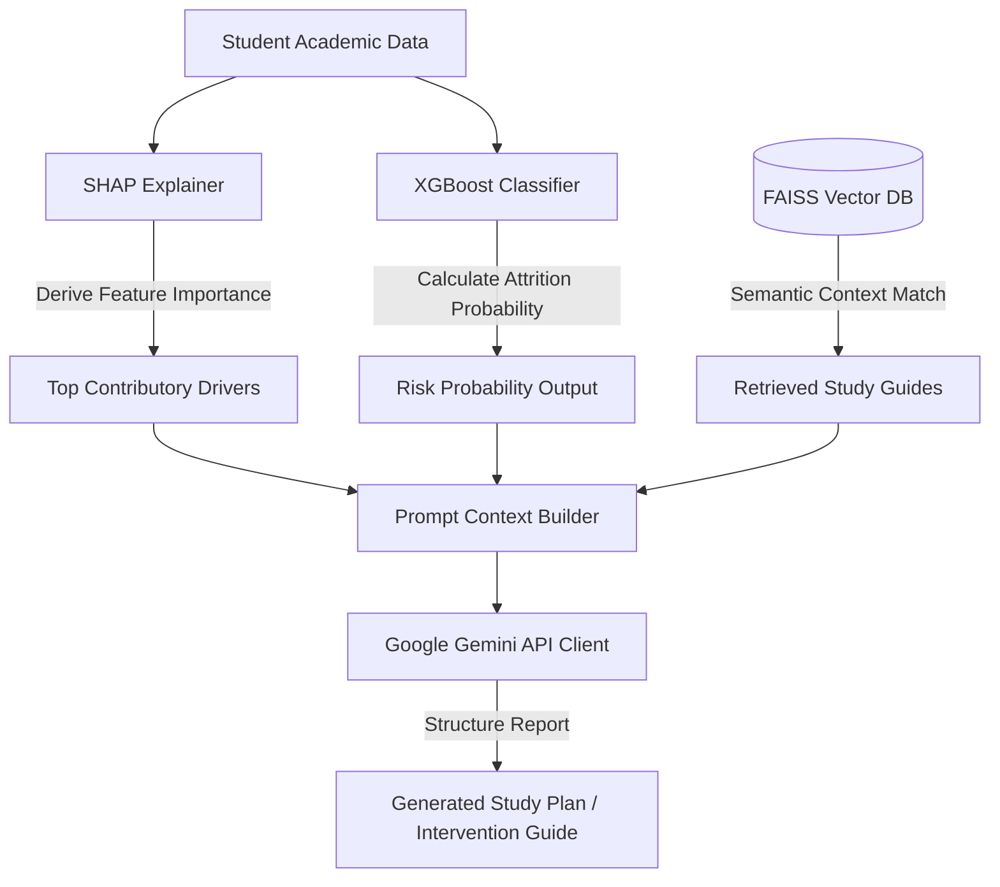

# 🎓 BodhyaAI: AI-Powered Academic Success & Mentoring Platform

<div align="center">

[](LICENSE)
[](https://nodejs.org/)
[](https://www.python.org/)
[](https://fastapi.tiangolo.com/)
[](https://react.dev/)
[](https://www.mongodb.com/)
[](https://ai.google.dev/)
[](https://www.docker.com/)

**BodhyaAI** is an enterprise-grade academic mentoring and student success orchestration platform. By combining machine learning risk classification, SHAP explainable AI, cognitive personality mapping, and a robust Google Gemini-powered Retrieval-Augmented Generation (RAG) agent, BodhyaAI empowers academic institutions to diagnose student attrition risks early, understand behavioral motivators, and automate targeted educational interventions.

[Table of Contents](#-table-of-contents) •
[Quick Start](#-quick-start) •
[Architecture](#-system-architecture) •
[AI Pipeline](#-ai-pipeline-architecture) •
[API Reference](#-api-documentation) •
[Future Roadmap](#-future-roadmap)

</div>

---

## 📌 Table of Contents

- [Project Overview](#-project-overview)
- [Problem Statement](#-problem-statement)
- [Key Features](#-key-features)
- [System Architecture](#-system-architecture)
- [AI Pipeline Architecture](#-ai-pipeline-architecture)
- [Database Schema & ERD](#-database-schema--erd)
- [Authentication & RBAC Security](#-authentication--rbac-security)
- [Tech Stack](#-tech-stack)
- [Folder Structure](#-folder-structure)
- [Installation & Environment Setup](#-installation--environment-setup)
- [Running the Project](#-running-the-project)
- [Environment Variables](#-environment-variables)
- [API Documentation](#-api-documentation)
- [Project Workflow](#-project-workflow)
- [Developer Scripts & Utilities](#-developer-scripts--utilities)
- [Testing Suite](#-testing-suite)
- [Deployment Guide](#-deployment-guide)
- [Performance Optimization](#-performance-optimization)
- [Security Audit Framework](#-security-audit-framework)
- [Future Roadmap](#-future-roadmap)
- [Documentation Directory](#-documentation-directory)
- [Contributing](#-contributing)
- [License](#-license)
- [Author & Acknowledgements](#-author--acknowledgements)

---

## 📖 Project Overview

**BodhyaAI** represents a paradigm shift in academic student retention and mentoring. Unlike traditional learning management systems (LMS) that only record performance post-hoc, BodhyaAI functions as a proactive **Early Warning System (EWS)**.

### Why BodhyaAI Exists
Academic failure and student dropouts rarely occur due to a single isolated factor. They are typically driven by a complex interplay of academic setbacks, socio-economic pressures, time-management challenges, and cognitive habits. BodhyaAI integrates these signals, leverages machine learning to predict risk factors, uses Explainable AI (XAI) to explain predictions to mentors, and builds actionable intervention study guides using LLMs.

### Target Audience
*   **Students**: Receive personalized study plans, structured Note-taking guides (Cornell method), and task trackers.
*   **Mentors (Advisors/Educators)**: Access actionable risk indicators, diagnostic details (SHAP), and LLM-generated cohort reports.
*   **Administrators**: Monitor overall institution risk health, manage user provisioning, and review system audit logs.

---

## ⚠️ Problem Statement

Modern higher education institutions struggle with:
1.  **Late Detection**: At-risk students are often identified only after failing terminal examinations, leaving no room for correction.
2.  **Lack of Interpretability**: Standard black-box predictive models can flag a student as "at-risk" but fail to explain *why* the student is struggling.
3.  **Mentoring Overhead**: Large student-to-mentor ratios prevent advisors from creating customized recovery paths and study plans for every student.
4.  **Siloed Systems**: Cognitive profiles (personality) and academic analytics are rarely integrated to provide a holistic view.

---

## 🌟 Key Features

| Domain | Feature Description |
|---|---|
| **🤖 Predictive AI** | XGBoost classifier mapping 21 key metrics to output a concrete academic risk score. |
| **🧠 Explainable AI (XAI)** | Real-time SHAP analysis translating ML feature weights into human-readable reasons (e.g., "Low Study Hours" or "High Travel Time"). |
| **📚 Generative AI & RAG** | Google Gemini API integration with semantic FAISS vectors to output customized Cornell Note study plans and Mentor Intervention Reports. |
| **👤 Personality Profiling** | BFI-44 survey compiling the **OCEAN** (Big Five) cognitive traits with shareable public invitation links. |
| **💬 Real-Time Chat** | Socket.IO based direct chat between mentors and assigned mentees with typing indicators and online state indicators. |
| **🛡️ Security & Audits** | Route-level JWT guardrails, strict Role-Based Access Control, and automated database user activity audit logging. |

---

## 🏗️ System Architecture

BodhyaAI is structured as a decoupled, high-performance monorepo:



### Microservice Interaction Sequence


---

## 🤖 AI Pipeline Architecture

The end-to-end AI workflow coordinates predictive modeling, explainability, semantic context retrieval, and structured text generation:



### AI Component Details
1.  **Risk Prediction (`risk-svc`)**: Takes academic parameters (CGPA, attendance, history of backlogs), socio-economic inputs (family income, support, travel time), and behavioral flags (study hours, social activities). Evaluated via XGBoost.
2.  **Explainable AI (`xai-svc`)**: Computes SHAP force values, determining which factors pushed the student towards the high or low-risk threshold.
3.  **Retrieval-Augmented Generation (`llm-svc`)**: Uses Sentence Transformers (`all-MiniLM-L6-v2`) to encode university curriculum guides and counseling logs into a FAISS index. Relevant guides are extracted and passed to Gemini as context.

---

## 📊 Database Schema & ERD

The primary storage runs on **MongoDB Atlas** using strict Mongoose modeling:

```
┌─────────────────┐        ┌─────────────────┐        ┌─────────────────┐
│      User       │        │     Student     │        │     Mentor      │
├─────────────────┤        ├─────────────────┤        ├─────────────────┤
│ _id             │        │ _id             │        │ _id             │
│ email (Unique)  │◄───────┤ userId          │◄───────┤ userId          │
│ password        │        │ mentorId (Ref)  │        │ mentees [Refs]  │
│ role (Enum)     │        │ academicData    │        │ department      │
│ name            │        │ riskProfile     │        │ bio             │
└────────┬────────┘        └─────────────────┘        └─────────────────┘
         │
         │                 ┌─────────────────┐        ┌─────────────────┐
         │                 │   AuditLog      │        │     Message     │
         │                 ├─────────────────┤        ├─────────────────┤
         └────────────────┤ userId          │        │ sender (Ref)    │
                           │ action          │        │ recipient (Ref) │
                           │ ipAddress       │        │ text            │
                           │ timestamp       │        │ read            │
                           └─────────────────┘        └─────────────────┘
```

*   **Indexes**: Unique index on `User.email`, compound index on `Message.sender_recipient_createdAt`, and index on `Student.userId` for fast profiles.

---

## 🔐 Authentication & RBAC Security

BodhyaAI enforces strict Role-Based Access Control:
*   **Student Role**: Accesses their own profile, completes surveys, views their custom Cornell/Pomodoro study plans, and chats with their assigned mentor.
*   **Mentor Role**: Manages their assigned mentees, triggers risk calculations, requests explainable SHAP diagrams, generates AI cohort performance reports, and communicates via chat.
*   **Admin Role**: Broad system settings access, unassigned student provisioning, audit trail log viewer.

---

## 🛠️ Tech Stack

| Component | Technology | Description |
|---|---|---|
| **Frontend** | React, Vite, CSS variables | Responsive, modern dashboard UI using standard CSS variables |
| **Backend** | Node.js, Express.js | Unified REST API Gateway & Server |
| **Realtime** | Socket.IO | Bi-directional communication layer |
| **Database** | MongoDB Atlas, Mongoose | Cloud document database & ODM |
| **AI Framework** | FastAPI, Python 3.10 | Microservices engine |
| **Machine Learning**| XGBoost, SHAP, Scikit-learn | Risk classification and Explainable AI |
| **Vector DB / RAG** | FAISS, Sentence Transformers | Semantic lookup store |
| **LLM Engine** | Google GenAI SDK (`google-genai`)| High-performance Gemini API integration |
| **DevOps** | Docker, Compose, Bash | Multi-container orchestration, automated pipelines |

---

## 📂 Folder Structure

```
BodhyaAi-Mentoring-Platform/
├── backend/                  # Node Express API Gateway Server
│   ├── src/
│   │   ├── config/           # DB connection
│   │   ├── controllers/      # Route controllers (LLM, Risk, Auth)
│   │   ├── middleware/       # Auth guards, Auditing, Consent rules
│   │   ├── models/           # Mongoose schemas (User, Student, Audit)
│   │   ├── routes/           # Express router endpoints
│   │   ├── services/         # PDF/CSV exporters
│   │   └── socket/           # Socket.IO connection handlers
├── frontend/                 # React UI Client using Vite
│   ├── src/
│   │   ├── components/       # Shared UI primitives
│   │   ├── dashboard/        # Dashboards (Student, Mentor, Admin)
│   │   ├── context/          # State hooks (Auth, Chat)
│   │   └── index.css         # Styling system
├── ai-services/              # Python FastAPI Machine Learning microservices
│   ├── common/               # Shared python package
│   ├── cog-svc/              # Personality OCEAN profiler (:8000)
│   ├── risk-svc/             # XGBoost risk classifier (:8001)
│   ├── xai-svc/              # SHAP explainer service (:8002)
│   ├── llm-svc/              # RAG & Gemini prompt engine (:8003)
│   └── requirements.txt      # Monorepo Python dependencies
├── scripts/                  # Operations and lifecycle bash scripts
│   ├── setup_project.sh      # Environment initializer
│   ├── run_project.sh        # Startup orchestrator
│   └── stop_project.sh       # Stop and cleanup utility
└── docker-compose.yml        # Docker composition runner
```

---

## 🚀 Installation & Environment Setup

### Prerequisites
*   **Node.js**: v18.0.0+ and `npm`
*   **Python**: v3.10+
*   **MongoDB**: Run a local instance or configure a MongoDB Atlas Cluster.
*   **Google Gemini API Key**: Grab one from [Google AI Studio](https://aistudio.google.com/).

### Initialization
Run the system setup tool to check requirements, configure default configurations, install project packages, and prepare the Python shared environment:

```bash
# Executing setup
./scripts/setup_project.sh
```

---

## 🏃 Running the Project

### Orchestrated Run (Development)
The stack can be launched concurrently using:

```bash
# Runs setup updates, checks ports, launches MongoDB, AI Services, Node Backend, and Vite UI
./scripts/run_project.sh
```
*   **Frontend Client**: `http://localhost:5173`
*   **Backend REST API**: `http://localhost:5001`
*   **AI Services**: fastapi ports `8000` to `8003`

### Production Run (Docker Compose)
Start the production-ready build:

```bash
# Starts all services using production config in background
docker compose -f docker-compose.prod.yml up -d --build
```

---

## 📝 Environment Variables

The system references environment configurations across three distinct areas. Place variables in local `.env` files:

### `backend/.env`
| Key | Default | Purpose |
|---|---|---|
| `PORT` | `5001` | Gateway port mapping |
| `MONGODB_URI` | `mongodb://localhost:27017/bodhyaai` | Database connection URI |
| `JWT_SECRET` | `super_secret_jwt_key` | Session validation secret |
| `COG_SVC_URL` | `http://localhost:8000` | Cognitive API URL |
| `RISK_SVC_URL` | `http://localhost:8001` | Risk API URL |
| `XAI_SVC_URL` | `http://localhost:8002` | XAI API URL |
| `LLM_SVC_URL` | `http://localhost:8003` | LLM API URL |

### `ai-services/.env`
| Key | Default | Purpose |
|---|---|---|
| `GEMINI_API_KEY` | *(Required)* | Google Gemini API Key |
| `REQUEST_TIMEOUT`| `30.0` | Call timeout (converted to ms in SDK) |
| `MAX_RETRIES` | `3` | LLM fallback attempts |

---

## 📖 API Documentation

Detailed endpoint schemas for major controllers:

### Authentication
*   `POST /api/auth/register` - Create user.
*   `POST /api/auth/login` - Validate credentials, return JWT.

### Student Profiles
*   `GET /api/students/my-profile` - Return student record.
*   `PUT /api/students/my-profile` - Update academic details.
*   `POST /api/students/my-profile/survey` - Submit BFI-44 answers.

### Academic Risk
*   `POST /api/risk/predict/:studentId` - Calculate risk and compute SHAP explanation.
*   `GET /api/risk/student/:studentId` - Retrieve student's current risk score.

### AI RAG & Reports
*   `POST /api/llm/study-plan` - Request Gemini-generated Cornell study plan.
*   `POST /api/llm/class-report` - Generate detailed cohort performance summary for mentors.

---

## 🔁 Project Workflow

The BodhyaAI lifecycle progresses sequentially:

```
[Student Registration] 
      │
      ▼
[Input Academic History] ──► [Take Cognitive Personality Survey]
      │
      ▼
[XGBoost Calculates Risk Rating]
      │
      ▼
[SHAP Computes Explanation Graph]
      │
      ▼
[Mentor Reviews Dashboard Alerts] ──► [LLM Compiles Cornell Study Plan]
      │
      ▼
[Real-Time Messaging & Interventions]
```

---

## 🛠️ Developer Scripts & Utilities

Automation is handled via clean modular shell utilities located in `scripts/`:

*   `./scripts/setup_project.sh` — Installs packages, configures environments, prepares local folders.
*   `./scripts/run_project.sh` — Launches background database, 4 python microservices, backend Express server, and Vite UI.
*   `./scripts/stop_project.sh` — Gracefully stops all components based on cached PID values.
*   `./scripts/status_project.sh` — Audits running processes, checking port bounds, CPU profiles, and memory logs.
*   `./scripts/health_check.sh` — Verifies connection loops to all database and microservice ports.
*   `./scripts/restart_project.sh` — Stops current run, runs clean checking, and boots fresh systems.

---

## 🧪 Testing Suite

Tests are isolated across system boundaries:

### Backend Tests
*   Mocha/Chai tests validating authorization middleware, router routing, and controllers.

### AI Services Tests
*   `pytest` scripts testing python APIs. 
*   Run the service validation suite:
    ```bash
    pytest ai-services/llm-svc/test_service.py
    ```

---

## 🌐 Deployment Guide

### Kubernetes Orchestration
Manifests are structured in `/kubernetes`:
*   `k8s-deployment.yml` maps pods, replica counts, and load balancer services.
*   `ingress.yml` exposes API gateway routes.

---

## ⚡ Performance Optimization

1.  **Model Cache**: `ModelManager` caches the last successful Gemini API model locally to skip lookup loops for subsequent calls.
2.  **Shared Runtime Packages**: Uses editable common python installations (`pip install -e common`) to avoid duplicate memory allocation across FastAPI processes.
3.  **Indexing**: Compound index patterns in MongoDB ensure rapid chat thread lookups.

---

## 🛡️ Security Audit Framework

*   **Password Cryptography**: Hashes passwords using `bcrypt`.
*   **Audit Logging**: The `auditMiddleware` intercepts student profile modifications, consent changes, and report requests, writing immutable records to `AuditLog`.
*   **Consent Framework**: Student records are strictly filtered inside `consentMiddleware` depending on user settings (`consentGiven`).

---

## 🗺️ Future Roadmap

- [ ] **Institutional Org Hierarchies**: Multi-tier access for Deans, Department Heads, and Admins.
- [ ] **LMS Integrations**: Live imports from Canvas, Moodle, and Blackboard.
- [ ] **Interactive Chatbots**: Real-time automated student guidance during off-hours.
- [ ] **Multi-Tenancy**: Support for hosting multiple independent universities.

---

## 📂 Documentation Directory

Explore detailed documentation under the `/docs` folder:
*   [Architecture Design](docs/ARCHITECTURE.md) — Comprehensive design structures.
*   [AI Pipeline](docs/AI_PIPELINE.md) — Information on machine learning, RAG, and LLM processing.
*   [API Endpoint Specifications](docs/API_REFERENCE.md) — JSON requests and responses.
*   [Deployment Guides](docs/DEPLOYMENT.md) — Deployment scripts and k8s config.
*   [Security Protocols](docs/SECURITY.md) — Cryptography, audit trails, and rules.
*   [Contributing Instructions](docs/CONTRIBUTING.md) — Coding conventions.

---

## 🤝 Contributing

Contributions are welcome! Please follow these steps:
1.  Fork the repository.
2.  Create a feature branch (`git checkout -b feature/AmazingFeature`).
3.  Commit your modifications.
4.  Push the branch (`git push origin feature/AmazingFeature`).
5.  Open a Pull Request.

---

## 📝 License

This project is licensed under the MIT License - see the [LICENSE](LICENSE) file for details.

---

## 👥 Author & Acknowledgements

*   **Lead Architect**: Poornateja Reddy
*   **AI Service Frameworks**: Google Gemini, FastAPI, XGBoost, SHAP, and FAISS.
*   **Backend & Frontend**: Node.js, Express, React, Socket.IO.
